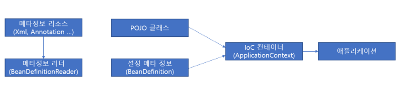
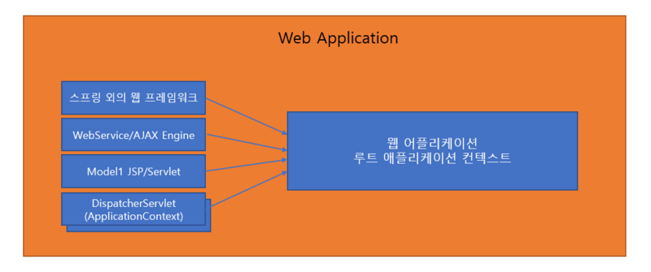

# IoC 컨테이너와 Bean Factory

Spring에서 사용되는 IoC란 객체가 내부적으로 조작할 객체를 직접 생성하지 않고 외부로부터 주입받는 기법을 의미한다. 이때 객체를 외부로부터 주입해주는 작업을 DI(의존성 주입)이라고 부른다.

IoC Container는 오브젝트의 생성과 관계설정, 사용, 제거 등의 작업을 대신 해준다하여 붙여진 이름이다. 이때, IoC Container에 의해 관리되는 오브젝트들은 Bean 이라고 부른다. IoC Container는 Bean을 저장한다고 하여, BeanFactory 라고도 불린다. BeanFactory는 하나의 인터페이스이며, Application Context는 BeanFactory의 구현체를 상속받고 있는 인터페이스이다. 실제로 스프링에서 IoC Container 라고 불리는 것은 Application Context의 구현체이다.

### 설정 메타정보

IoC 컨테이너가 관리하는 Bean으로 등록하기 위해서는 적절한 메타정보를 만들어 제공해야 한다. 스프링의 설정메타 정보는 `BeanDefinition` 이라는 인터페이스이다. Xml, 애노테이션, 자바 코드, 프로퍼티 파일 전부 상관없이 `BeanDefinitionReader` 라는 인터페이스에 의해 `BeanDefinition` 객체로 변환된다. Spring IoC는 이러한 설정 메타정보를 통해 오브젝트를 생성하고 DI 작업을 수행한다.

### IoC 컨테이너의 종류

> StaticApplicationContext

StaticApplicationContext는 코드를 통해 빈 메타정보를 등록하기 위해 사용한다. 스프링의 기능에 대한 학습 테스트를 만들 때를 제외하면 실제로 사용되지 않는다. 웹 관련 기능을 공부하며 학습 테스트로 검증하고 싶을 때는 `StaticWebApplicationContext`를 사용한다.

> GenericApplicationContext

실전에서 사용될 수 있는 모든 기능을 갖추고 있는 애플리케이션 컨텍스트이다. `StaticApplicationContext`와 달리 XML 파일과 같은 외부의 리소스에 있는 빈 설정 메타정보를 리더를 통해 읽어들여서 메타정보로 전환하여 사용한다.

> GenericXmlApplicationContext

`GenericApplicationContext`에서 `XmlBeanDefinitionReader`를 내장하고 있어, Xml을 읽어 사용할 때 편리하다.

> WebApplicationContext

스프링 애플리케이션에서 가장 많이 사용된다. Xml 설정 파일을 사용하는 경우에는 `XmlWebApplicationContext`를 사용하며, 애노테이션을 사용한다면 `AnnotationConfigWebApplicationContext`를 사용한다.

### 웹 환경 애플리케이션 구조

웹 환경에서의 스프링은 클라이언트의 요청을 전부 받는 `FrontController`, `DispatcherServlet`을 제공한다. `DispatcherServlet`는 자체적으로 ApplicationContext를 생성하고, Root Application Context를 부모로 등록한다.

### IoC 컨테이너 계층구조

IoC 컨테이너는 계층구조로 구현할 수 있다. 각자 독립적으로 빈을 갖고 있으며, 자신의 어플리케이션 컨텍스트에 빈이 존재하지 않을 경우, 부모 어플리케이션 컨텍스트에서 빈을 찾는다. 중요한 점은 자식 어플리케이션 컨텍스트에서는 탐색하지 않는다는 점이다.

미리 만들어진 어플리케이션 컨텍스트의 설정을 그대로 가져다가 사용하면서 그중 일부 빈만 설정을 변경하고 싶다면, 어플리케이션 컨텍스트를 두 개 만들어서 하위 컨텍스트에서 바꾸고 싶은 빈들을 설정해줘도 된다.

### 일반적인 웹 어플리케이션의 IoC 컨테이너 구성

DispatcherServlet은 자체적으로 ApplicationContext를 생성하고 사용한다. 이를 `ServletContext` 라고도 부른다. 이외에도 RootApplicationContext가 하나 존재하는데, 이는 스프링 외의 기술을 사용하는 Ajax Engine, JSP 등에서 Spring IoC의 기능을 사용할 수 있도록 하기 위함이다. 스프링 밖의 어디서라도 `WebApplicationContextUtils.getWebApplicationContext(ServletContext sc)` 를 호출하면 루트 어플리케이션 컨텍스트를 가져올 수 있다.