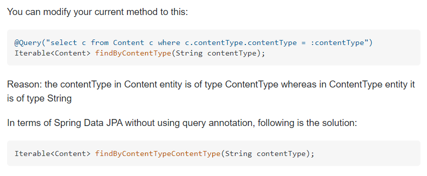

# Spring data JPA - parameter value did not match expected type 에러

- 

- ```java
      @GetMapping("/{certificateCode}")
      public ResponseEntity<List<AcceptanceRate>> certificateDetail(@PathVariable String certificateCode) {
          try {
              List<AcceptanceRate> result=acceptanceRateRepository.findByCertificateCode(certificateCode);
              
              return new ResponseEntity<>(result, HttpStatus.OK);
  
          } catch (IllegalStateException e) { // exception return 하게 수정
              List<AcceptanceRate> box=null;
              return new ResponseEntity<>(box, HttpStatus.BAD_REQUEST);
          }
      }
  ```

- `certificateCode` (종목 코드, 자격증 코드)를 인자로 받아 해당 자격증의 합격률 정보를 반환 시키고자 하는 코드.

- 위 에러 페이지에서 데이터 예시를 보면 `AcceptanceRate` 테이블의 "`certificateCode`" 칼럼은 `certificate ` table의 `certificateCode`를 외래키로 하는 칼럼.

- 이 같은 상황에서 객체 자체를 인자로 받아야 하지만, 종목코드가 들어가 Type 에러가 발생한다.

### 해결책



- 나는 `JPA`를 사용하고 있으므로 아래 해결책을 사용.
- 다음처럼 칼럼명을 두번 연속 작성한 findBy문을 사용해주면 신기하게도 jpa가 알아서 해당 객체의 칼럼을 찾아가 준다.
- **유의**
  - 당연히 Repository 파일에도 메소드명을 동일하게 해주어야함.

