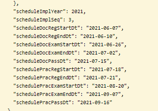

# Spring JPA 날짜 데이터 반환 이상현상


> JPA에서 날짜 데이터를 반환 시켜 확인을 해보니 (반환 데이터 형태: Json) 날짜 값이 이상하게 반환 되는 경우.


- 나 같은 경우는, 자격증의 일정 데이터를 반환해야 하기 때문에 LocalDate(Local Datetime) 문제 해결 방식에 적합하지 않았다.


### 내가 해결한 방법.

```java
    @Column(name = "schedule_doc_reg_start_dt")
    @JsonFormat(pattern = "yyyy-MM-dd")
//    @DateTimeFormat(pattern = "yyyy-MM-dd")
    private Date scheduleDocRegStartDt;
```

- DateTimeFormate 어노테이션 대신 JsonFormate 어노테이션을 사용해 테이블을 다시 만듦.
- 
  - 정상적인 형식으로 날짜 데이터가 반환되는 것을 확인할 수 있다.
  - Json 형태로 데이터를 반환시키는 것이기 때문에 (RDBMS, MySQL을 사용해 데이터를 저장하고 관리하고 있다고 해도.) 테이블을 구성할 때 JsonFormat을 사용해줘야 하는  것 같다.